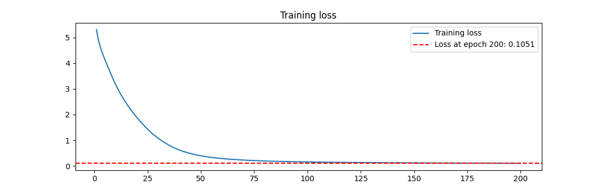
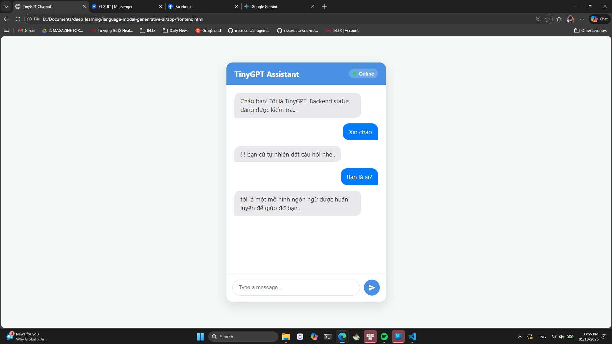

# TinyGPT: High-Efficiency Vietnamese LLM for Greetings with Low-resource Architecture


> `TinyGPT` demonstrates a complete **end-to-end MLOps ecosystem**, extending from raw model training pipelines to localized deployment. At its core is a highly optimized **GPT Decoder-only** architecture (NanoGPT scale).
>
> Instead of relying on massive scale, this project focuses on **architectural efficiency** and **system integration**. With exactly **214,912 parameters**, the model is engineered to be ultra-lightweight. It serves as a generic Proof-of-Concept for deploying dense transformer models in strictly constrained environments, utilizing only a fraction of standard 6GB VRAM/RAM budgets.
## Model Architecture
### Model Description
```bash
==============================================================================================================
                                       VIHELLO MODEL SCIENTIFIC SUMMARY                                       
==============================================================================================================
Total Parameters:         214,912
Active Parameters:        214,912.0 (Dense Model)
Model Efficiency:         1.0x (Compute saving)
--------------------------------------------------------------------------------------------------------------
Format             | Bit   | Size (MB)    | Compression  | Mem Saving   | Note
--------------------------------------------------------------------------------------------------------------
FP32 (Original)    | 32    |      0.82 MB |        1.0x |        0.0% | Master Copy
BF16/FP16          | 16    |      0.41 MB |        2.0x |       50.0% | Standard
INT8               | 8     |      0.20 MB |        4.0x |       75.0% | Standard
INT4 (GGUF)        | 4     |      0.10 MB |        8.0x |       87.5% | Best for Toys
--------------------------------------------------------------------------------------------------------------
[*] MLA Latent Compression: 4.0x KV-Cache reduction
[*] Inference Speed Grade: S+
==============================================================================================================
```


## Training 

### Training loss



## Deployment

### Web interface

